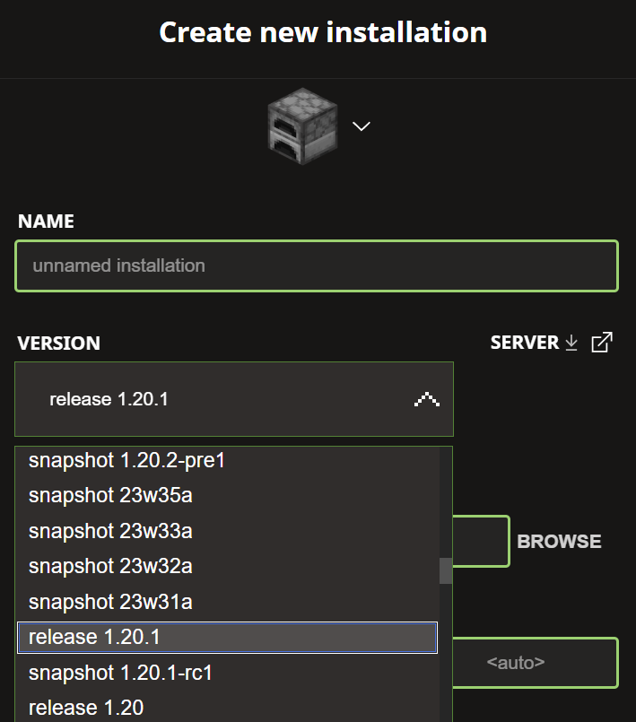
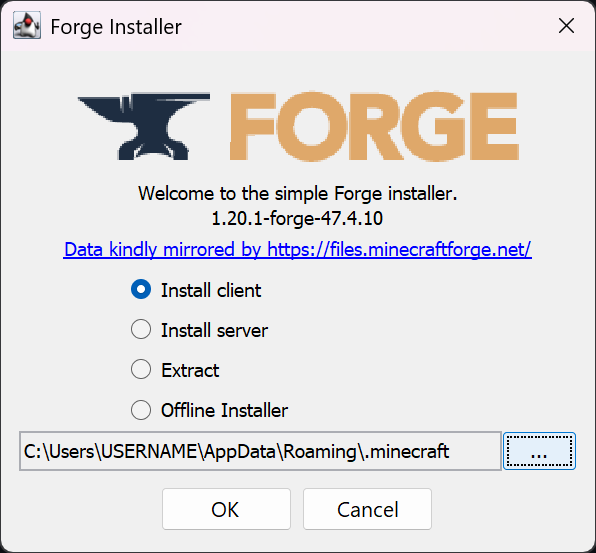
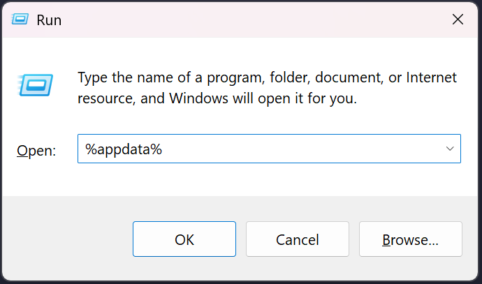
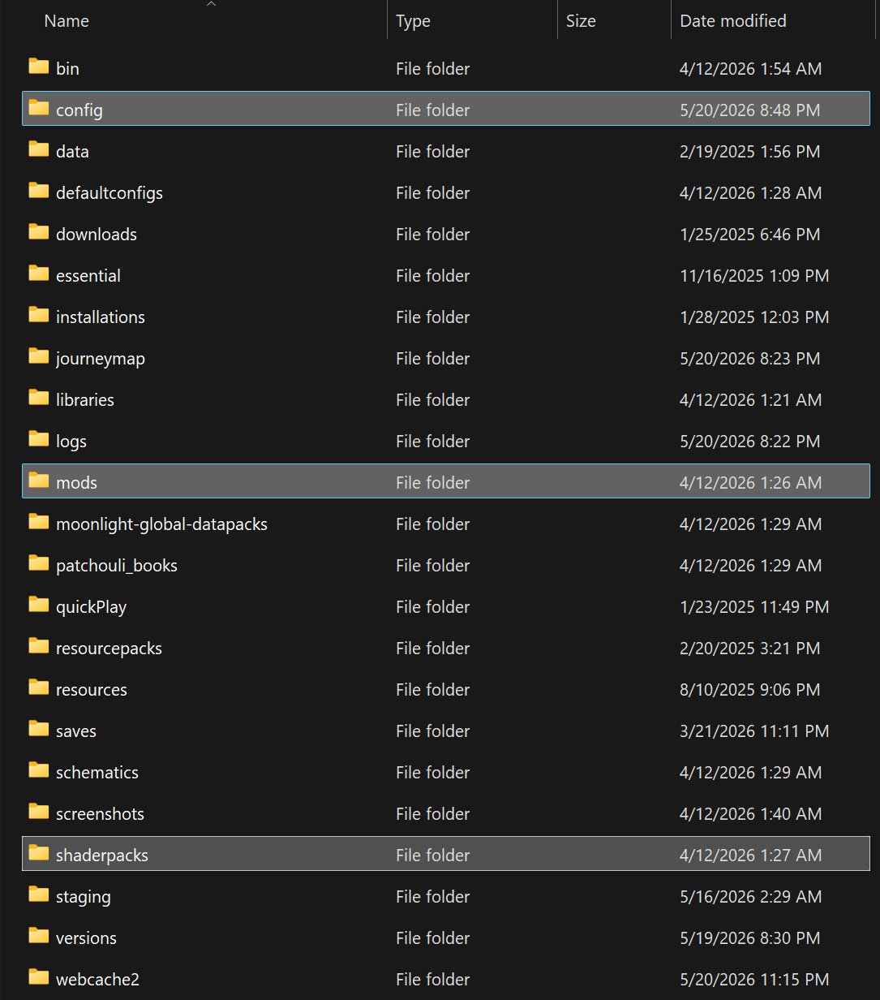
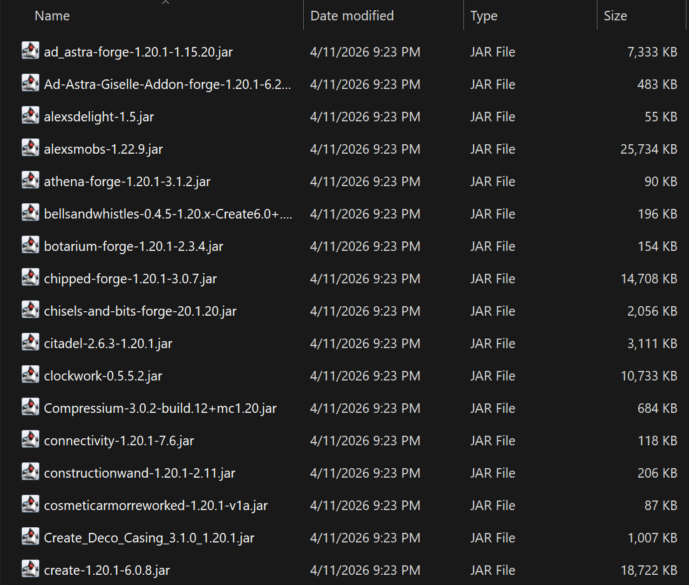
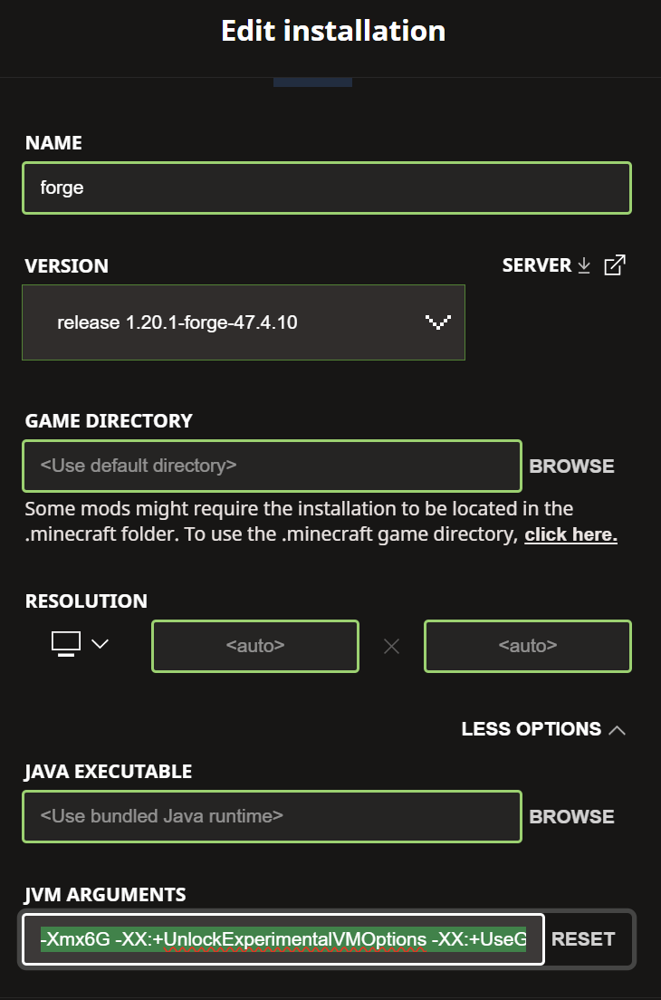

# BAW-BOP Modded Minecraft Server

Welcome to BAW-BOP-MC! This is a mod pack for our Minecraft Forge 1.20.1. Most of the mods in this pack are based off of [The Bunker Boys Modpack](https://www.curseforge.com/minecraft/modpacks/the-bunker-boys), although we've changed some things around to tailor it to our server experience.

Below, you will find the installation instructions for setting up the modpack manually. Alternatively, if you would like a more straightforward installation, you can use the Modrinth files, `.mrpack`. Specific instructions will be included in Discord.


## "Which release do I choose?"

There are two versions of the modpack, either of which can be used to join the server. The only difference is the client-side visual quality:

**Client-Fast**: Contains the standard modpack (68 mods). Recommended for most players.
- **CPU:** Intel i5 (10th gen+) / AMD Ryzen 5 3600 or better
- **GPU:** GTX 1050 Ti / RX 570 or better
- **RAM:** 8GB system RAM. (Close out every other application before launching)
- **Storage:** SSD strongly recommended

**Client-Fancy**: Contains the full visual experience (70 mods + 4 shaderpacks). Exactly the same as Client-Fast, but with shader support and extended render distance (via Oculus and Farsight, respectively). Only use this if your PC is beefy enough to handle it comfortably.
- **CPU:** Intel i5 (12th gen+) / AMD Ryzen 5 5600X or better
- **GPU:** RTX 3060 / RX 6600 XT or better
- **RAM:** 16GB system RAM (32GB would be ideal)
- **Storage:** SSD required

If you're not sure which one to choose, **I recommend starting with Client-Fast**. You can always switch over to the Client-Fancy later on anyway. 
Additionally, check out the Performance Tips section below if you want to squeeze out any more performance from your system.


## Installation - Modrinth

### Step 0: Download the Modrinth app

For a much easier installation process, you can use the Modrinth app. The installation location is also seperated under `%appdata%/roaming/modrinthapp/profiles` rather than the traditional `%appdata%/roaming/.minecraft`

1. Download the [Modrinth app](https://modrinth.com/app)
2. When first running Modrinth, sign in using your Minecraft/Microsoft account.

### Step 1: Download the .mrpack file

Go to the **[BAW-BOP-MC Releases](https://github.com/Maltent/BAW-BOP-MC/releases)** page and download one of the two `.mrpack` files determined in the section 'Which release do I choose?':

### Step 2: Import the modpack to Modrinth

1. Find the + on the left sign of the Modrinth app.
2. Select the **Install Modpack** option and then **Import Modpack**.
3. Select the `.mrpack` file that you downloaded.

A warning will appear since the file is not officially uploaded to Modrinth. Ensure you only recieved the file from an **official** link. You can safely select **Install Anyways**.

### Step 3: Adjust the modpack's RAM allocation

Modpacks require much more RAM than typical minecraft, so the default value will cause several lag spikes.

1. Under Library, right-click the modpack instance and select **View instance**
2. In the top-right, click on gear icon and and navigate to **Java and memory**
3. Under Memory allocated, select custom allocation and input one of the values below:
   - 4096 MB (MINIMUM)
   - 6144 MB (RECOMMENDED)
   - 8192 MB (16GB+ RAM)

### Step 4: Launch the Modpack

Anytime you want to play using the modpack, launch the game through Modrinth. You no longer need to go through the official Minecraft launcher.

## Installation - Manual

### Step 0: Run Minecraft 1.20.1 at least once

Before starting, we need to generate the game files that Minecraft Forge needs.

1. Open the Minecraft Launcher and go to **Installations** > **New Installation**
2. Select version **1.20.1** from the Installations tab and click **Install** at the bottom right. 
3. Launch the game. Wait until you reach the main menu, then close the game. 
 


### Step 1: Install Forge 47.4.10

**[Download Forge 1.20.1 - 47.4.10 Installer](https://maven.minecraftforge.net/net/minecraftforge/forge/1.20.1-47.4.10/forge-1.20.1-47.4.10-installer.jar)**

Once downloaded:
1. Double-click the `.jar` file to run it. If it doesn't open, right-click > **Open With** > **Java(TM) Platform SE Binary**.
2. Make sure the path matches the same format as the image below. Select **"Install client"** and click **OK**.



3. Open the Minecraft Launcher and launch the profile labeled **1.20.1-forge-47.4.10**
4. Once it reaches the menu, confirm that the correct version is installed at the bottom left, then close the game.

### Step 2: Download the modpack

Go to the **[BAW-BOP-MC Releases](https://github.com/Maltent/BAW-BOP-MC/releases)** page and download the release determined in the section 'Which release do I choose?':
- `BAW-BOP-client-fast-V1.0.zip`
- `BAW-BOP-client-fancy-V1.0.zip`

### Step 3: Clean your mods folder

Before installing, make sure your `.minecraft` folder doesn't have leftover mods from a previous modded playthrough. If there are existing files in your `mods/`, `shaderpacks/`, `config/` folders or `options.txt`, copy them somewhere safe on your computer (e.g. in a folder on your Desktop), then delete everything in your `mods/` folder.

 An empty mods folder is important, as any stray mods from other packs will cause crashes/incompatibility with joining the server.

To find your `.minecraft` folder:
1. Press **Windows + R** on your keyboard
2. Type `%appdata%` and click **OK**
3. Open the `.minecraft` folder (first folder in the list)



If you don't see a `mods/` folder, that's fine, as we will be creating it in the next step.

### Step 4: Extract the modpack

1. Open the zip file you downloaded. Inside, you'll see a `mods/` folder, a `config/` folder, and `options.txt` (If you downloaded Fancy, you'll see a `shaderpacks/` folder too).

2. Extract the contents of the zip directly into your `.minecraft` folder. 
    * This can be done by drag-and-dropping or copying the files from the zip folder **directly** into `.minecraft`. 
    * The contents of the zip should merge with your existing files, and your `mods/` folder should now contain several `.jar` files and your config folder should have `.json` or `.toml` file types.





### Step 5: Launch and play! :D

Open the Minecraft Launcher, select the **Forge 1.20.1** profile, and click **Play**.

The first launch will take longer than usual (about 1 - 2 minutes) as Forge loads all the mods. Once you reach the main menu, click **Multiplayer**, add the server via the link in Discord, and join!


## Performance Tips

If you're experiencing low FPS or long load times, try these:

**Allocate more RAM to Minecraft:**
1. Open the Minecraft Launcher
2. Go to **Installations** > click your Forge profile > the three dots > **Edit**
3. Expand **More Options** at the bottom right
4. In the **JVM Arguments** box, find `-Xmx2G` (or similar) and change it to:
   - 4GB (MINIMUM): `-Xmx4G`
   - 6GB (RECOMMENDED): `-Xmx6G`
   - 8GB (if you have 16GB+ RAM): `-Xmx8G`
5. Make sure to click **Save** before closing.

Additionally, you can also consider adding the following flags to the JVM Arguments. These may help with memory garbage collection:

``-XX:+UnlockExperimentalVMOptions -XX:+UseG1GC -XX:G1NewSizePercent=20 -XX:G1ReservePercent=20 -XX:MaxGCPauseMillis=50 -XX:G1HeapRegionSize=16M``



## Need More Help?

If you run into any issues, reach out to either Sparklebird59 or Maltent on the BAW-BOP Discord server! We're happy to help you get set up :D


<br><br><br>
# SERVER ADMIN STUFF


## Repo Structure

This repo is organized into layers that combine to create the different releases:

 - `base/` contains all the mods shared across the server and all clients
 - `client/` has all mods necessary for every client release
 - `visuals/` holds graphics mods and shaders for the Client-Fancy release
 - `server/` includes only server-side mods
 - `releases/` contains powershell scripts that are used on a local repo to quickly package the Github releases.

**Structure of each release:**
 - `Client-Fancy`
    * `base/` + `client/` + `visuals/`
 - `Client-Fast`
    * `base/` + `client/`

Mods in the `server/` folder are not packaged into any releases.


## Building Releases (For Admins)

Run the following commands sequentially in Powershell:

```powershell
git clone https://github.com/Maltent/BAW-BOP-MC
cd C:\Users\<USERNAME>\BAW-BOP-MC\releases
build-client-fast.ps1
build-client-fancy.ps1
```

This creates zip files in the `releases/` folder with a `VX.X` placeholder version. Make sure to rename them to the actual version number before uploading to GitHub.


<!---
OLD README CODE FOR IMAGES:


================ HERE LIES THE OLD README FILE, JUST IN CASE IT'S NECESSARY STILL

# Welcome to the BAW-BOP-MC Modpack!
Modpack for the BAW BOP Minecraft Server. {heavily wip}

{put a nicer description here soon}

## Mod List:
[(Link to Google Document containint the mod list)](https://docs.google.com/document/d/10r6xUfpXC2QrtwfRxElvx27GJ5jdHwNjNsDrACdMfjs/edit?tab=t.0)

^ This contains more specific information about each mod if you are curious. {reword this}

## Mod Installation Instructions {ROUGH - REVISE LATER}:  

**(0. Make sure you have Minecraft Forge - MC 1.20.1 Installed)**
 - Run Minecraft version 1.20.1 at least once to generate your game files
 - Go to [this link](https://files.minecraftforge.net/net/minecraftforge/forge/index_1.20.1.html) and download the {CHECK WHICH VERSION TO PUT HERE}
 - Run the installer (you may have to right click > select "Open With" > Java). Select "Install client" and click "OK"
 - Select the new Forge profile in the Minecraft Launcher and launch the game to confirm it's working.

**1. Go to [BAW-BOP-MC Releases](https://github.com/Maltent/BAW-BOP-MC/releases) and download the latest version of the modpack**
- 'client-fast.zip' is the standard modpack that has everything necessary to join and play on BAW BOP MC
- 'client-fancy.zip' is for beefier computer. Download this if you think your computer can handle more graphically intensive mods (See mods list for specifics)

**2. Navigate to C:\Users\\[USERNAME\]\AppData\Roaming\.minecraft\mods**
- On your keyboard, press "Windows + R"
- Type '%appdata%' into the dialog and click "OK"
- Click throught the folders until you get to the mods folder

**3. {Unzip the contents of the modpack zip file into mods}**
- {TECHNICALLY, FORGE CAN READ .zip FILES DIRECTLY AS LONG AS ALL THE .jar FILES ARE IN THE ROOT DIRECTORY}
- {SO MAYBE JUST HAVE THEM CUT-PASTE THE .zip FILE DIRECTLY AND LEAVE IT AT THAT}

**4. Launch the game and join the server :D**
- If you are having issues, send us a message on the Discord server and we can help you out.

===============================
## TO-DO LIST FOR ADMINS
- Make sure that the current mod organization is correct
- Add some server-size mods (e.g. plug-ins, moderation, backups, optimization mods, etc.)
- create the releases for the mods
  - Consider adding version to the modpack to avoid confusion (e.g. client-fast-V1.0)
- Revise this markdown file with better sections and organizations
  -  Have instructions for people installing the modpack
    - Explain the folder organization w/ more detail
    - Put screenshots and other fun fancy stuff
      - Server logo? (we can put that as the server icon too :o)


## [Mods folder organization]
'/base' - mods that exist in all other folders  
'/serverOnly' - mods for only the server  
'/clientOnly' - mods for only players  
'/clientFancy' - mods if your computer can handle it  

## [Releases setup + combinations]  
- serverMods.zip - zip folder for the server (not technically needed but maybe it would be nice to have?)  
  - base + serverOnly  
- client-fast.zip - basic modpack for clients  
  - base + clientOnly  
- client-fancy.zip - modpack installation for clients with beefier computers  
  - base + clientOnly + clientFancy  

=====================================================================
guide to markdown formatting:
https://www.markdownguide.org/cheat-sheet/

Heading	
# H1
## H2
### H3

Bold	
**bold text**

Italic	
*italicized text*

Blockquote	
> blockquote

Ordered List	
1. First item
2. Second item
3. Third item

Unordered List	
- First item
- Second item
- Third item

Code	
`code`

Horizontal Rule	
---

Link	
[title](https://www.example.com)

Image	


---> 
